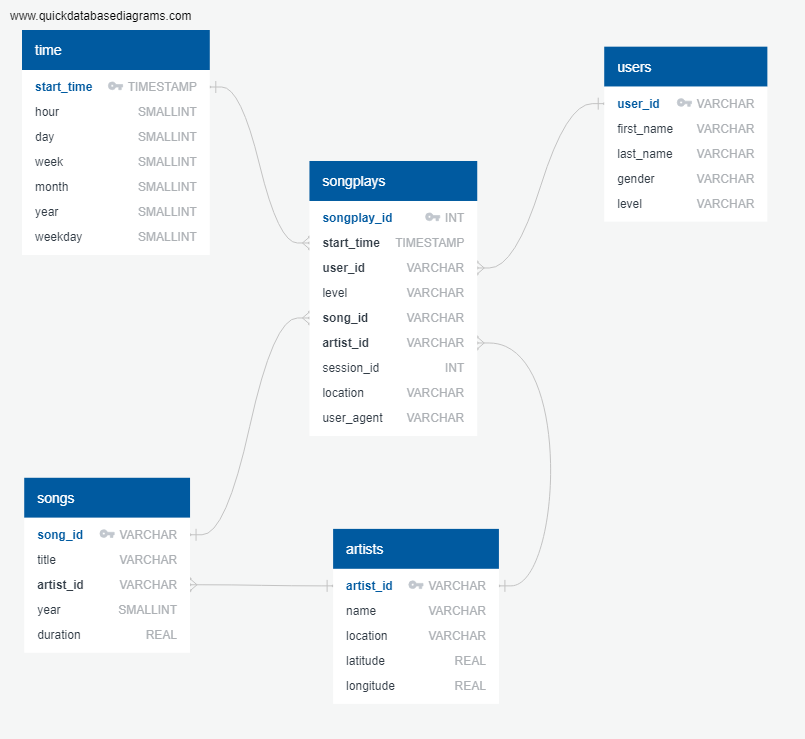

# DEP4 - Data Lake with Spark
Project 4 of the Data Engineering Nanodegree  
Michal Pytlos, September 2019

## Overview
DEP4 is an ETL pipeline built for a music streaming startup. The startup's data is stored on S3 in the form of JSON logs. Using Apache Spark, DEP4 loads this data into intermediate DataFrames and then processes into analytics tables. Finally each analytics table is saved on S3 as a collection of parquet files.

### Data
The startup's data is stored in a public bucket on S3 in two directories:
* **s3://udacity-dend/song_data** - files with songs metadata. Each file contains metadata on a single song in the JSON format with the following fields: num_songs, artist_id, artist_latitude, artist_longitude, artist_location, artist_name, song_id, title, duration and year.
* **s3://udacity-dend/log_data** - user activity log files. Each file contains data on user activity from a given day. Each line of this file contains data on a single activity of a user in JSON format with the following fields: artist, auth, firstName, gender, itemInSession, lastName, length, level, location, method, page, registration, sessionId, song, status, ts, userAgent and userId.

Notes on data:
* Song streaming events in the user activity log files have the *page* field set to *NextSong*.
* Songs from the user activity logs can be matched with their metadata files by comparing artist, song and length in the log file with artist_name, title and duration in the metadata file respectively.

### Data lake schema
Data lakes employ the schema-on-read data model. The analytics tables were designed, however, to a particular schema shown in Figure 1. Tables *songplays* (fact table), *users*, *songs*, *artists* and *time* form a star schema optimized for queries on song play analysis. The chosen schema, compared to a highly normalized schema, allows for easier and faster data analytics by making the queries much simpler (fewer joins). Note that the relations between the tables shown in Figure 1 are not enforced in any way as there is no concept of primary and foreign keys in Spark.

*Figure 1: Schema of the analytics tables*

### ETL pipeline
DEP4 performs the following:
1. Load song and log data from S3 to two intermediate DataFrames. In order to speed up data loading from S3, instead of using globbing to find all the relevant json files, list of their S3 keys is obtained using boto3.
2. Extract data from the intermediate DataFrames to the five analytics tables (DataFrames) shown in Figure 1.
3. Save each analytics table to S3 as a collection of parquet files; partition *songplays* and *time* by year and month and *songs* by year and artist_id.

## Prerequisites
* Access to cluster with Apache Spark e.g. Amazon EMR (ideally in the same region as the S3 bucket i.e. *us-west-2*)
* All nodes*: Python 3.7 or higher with boto3 1.9.7 or higher and pyspark 2.4.3 or higher.

&ast; See [spark.apache.org](http://spark.apache.org/docs/latest/cluster-overview.html) for an overview of the architecture of a cluster.

## Configuration
The provided configuration file **dl.cfg** has several fields which need to be set before **etl.py** can be run; these fields are briefly described below:

| Section | Field  | Value|
| -------| --------|-------|
| AWS| AWS_ACCESS_KEY_ID| Access key ID of user with AmazonS3FullAccess permission|
| AWS| AWS_SECRET_ACCESS_KEY| Secret access key of user with AmazonS3FullAccess permission|
| AWS| AWS_DEFAULT_REGION| us-west-2|
| INPUT| LOCAL_INPUT| Flag: source input from local FS. Allowed values: true/false, 0/1.|
| INPUT| S3_BUCKET| S3 bucket name|
| INPUT| S3_SONG_PREFIX*| S3 key prefix common to all song files|
| INPUT| S3_LOG_PREFIX| S3 key prefix common to all log files|
| INPUT| LOCAL_SONG_PATH| Glob pattern returning path to all song files. Used only if LOCAL_INPUT is set to true.|
| INPUT| LOCAL_LOG_PATH| Glob pattern returning path to all log files. Used only if LOCAL_INPUT is set to true.|
| OUTPUT| LOCAL_OUTPUT| Flag: save output to local FS. Allowed values: true/false, 0/1. |
| OUTPUT| S3_BUCKET| S3 bucket name|
| OUTPUT| S3_PREFIX| S3 key prefix common to all output files|
| OUTPUT| LOCAL_OUTPUT_PATH| Path to directory where the output files are to be saved. Used only if LOCAL_OUTPUT is set to true.|

&ast; See [docs.aws.amazon.com](https://docs.aws.amazon.com/AmazonS3/latest/user-guide/using-folders.html) to learn about the S3 structure and the concept of the key prefix.

## Usage
#### Spark in non-local mode
The project has to be submitted to the cluster via the **spark-submit** script; see [spark.apache.org](https://spark.apache.org/docs/latest/submitting-applications.html) for more information.

#### Spark in local mode (Project Workspace provided by Udacity)
Run the script from the terminal:
1. Navigate to the directory containing **etl.py**
2. Run `python etl.py`
